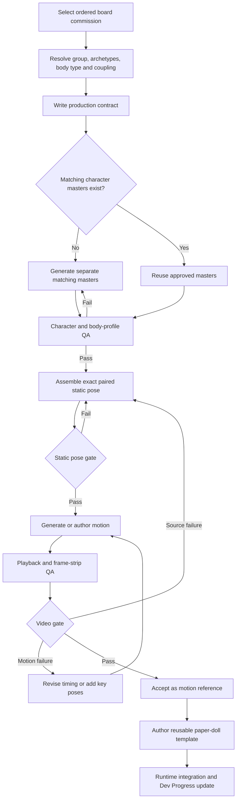

# Pairing Production Pipeline

> **Status: lookup API, record schema, research registry, and QA contract implemented; authored paper-doll animation and runtime resolver remain planned.**

This pipeline applies to any ordered pairing group, species cast, size combination, presentation profile, and output target. It separates the reusable commission identity from the species chosen to perform it and from any particular generated or authored attempt.

## Canonical flow



The static-pose gate is deliberately before any paid animation call. A source must already have the correct presentation profile, scale relationship, contact anchor, hand placement, support, occlusion, camera, and eyelines. Motion generation is not expected to repair a bad composition.

## Three independent identities

Every attempt records three different kinds of identity:

1. **Pairing group** — `m+f`, `m+m`, or `f+f`, mapped to Jack & Jill, Jack & Jack, or Jill & Jill.
2. **Ordered body commission** — for example `large_neutral>medium_neutral`, named `Titan + Ranger` on the `m+f` board. Reversing the order is a different commission.
3. **Species cast** — the actual performers, such as Golem + Cow. A cast may use the species registry defaults or an explicit individual/study override without modifying the species-wide mapping.

The stable commission key combines group and direction:

`jack_jill|large_neutral>medium_neutral`

Display names are not used as persistent keys.

## Lookup API

`PairingProgress` exposes data-driven group and pairing lookups:

```gdscript
var mixed := PairingProgress.get_pairing_lookup("m+f", "Titan", "Ranger")
var same_sex := PairingProgress.get_pairing_lookup("m+m", "large_neutral", "medium_neutral")
var by_title := PairingProgress.find_pairing("Lifted Horizon", "m+f")
var all_large_to_medium := PairingProgress.find_pairings("large>medium")
var study := PairingProgress.get_production_record("research.titan-ranger.golem-cow.v01")
```

External art, generation, and audit tooling can query the same catalog without launching Godot:

```powershell
python scripts/pairing_lookup.py --group m+f --first Titan --second Ranger
python scripts/pairing_lookup.py --group m+m --query "large>medium"
python scripts/pairing_lookup.py --record research.titan-ranger.golem-cow.v01
```

The canonical lookup contains:

- board ID, group key, and group name;
- stable commission key;
- role-aware archetype pairing name and slug;
- directional body-type, size-pair, and morphology-pair keys;
- Regular/Inverted order;
- coupling title and theme description;
- first/second role, archetype, emoji, size, and morphology;
- current authored-script count and progress percentage.

`data/breeding_script_progress.json` is the source of truth for group and archetype lookup data. The UI reads the same group records rather than maintaining a second hard-coded board list.

## Production record

Every generated study or authored animation may be registered in `data/pairing_production_records.json` and validated against `schemas/pairing_production_record.schema.json`. A record snapshots the lookup values used at the time, identifies both cast members, declares any body-type overrides, stores the production contract, and records sources, paid render metadata, artifacts, and gate results.

The five required gates are:

1. **Character match** — identity, species, silhouette, size, and shared visual language.
2. **Body profile** — `SFW_CLOTHED`, `SFW_UNCLOTHED`, or `NSFW` is correct before staging.
3. **Static pose** — contact anchor, leverage, weight support, occlusion, camera, and partner-only eyelines are correct in the still.
4. **Motion** — beat count, anchor stability, scale, anatomy, gaze, secondary motion, and loop behaviour survive playback.
5. **Integration** — the motion has been authored as a runtime template, tested, credited, and connected to the resolver.

A technically successful provider render may still fail one or more production gates. It remains retained and labelled research; it does not increment Dev Progress or become fallback coverage.

## Partner-focus default

Paired scenes default to private interaction. Actors look at each other, at a relevant contact point, or close their eyes naturally. They do not look into the camera, wink at the player, or present to an audience. A camera-facing variant must deliberately override and label that rule.

## Current example

`research.titan-ranger.golem-cow.v01` proves the record can describe a useful failure. The render preserved both characters and the Large→Medium scale gap, but its static source used the wrong presentation profile and placed the cow over the golem's thigh instead of the declared pelvis-centred anchor. Its decision is therefore `revise`, even though the provider task completed successfully.
